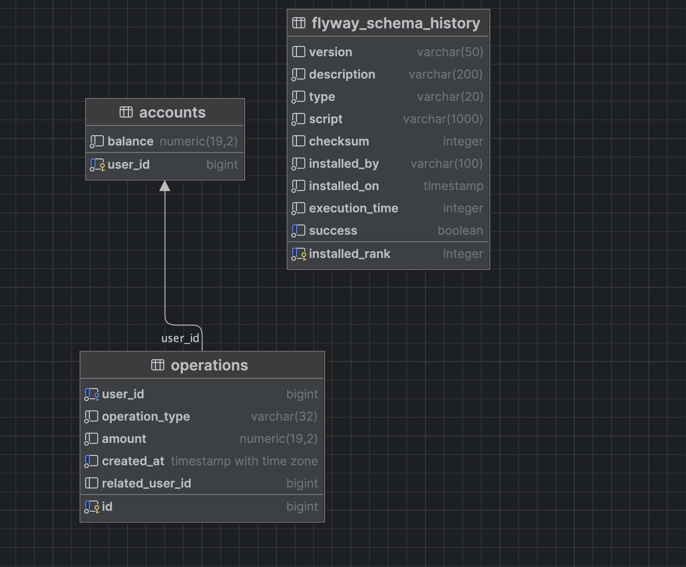

# API For Bank

REST API для работы с банковским счетом.

## Технологии
- Java 17
- Maven 3.9+
- Spring Boot 3
- PostgreSQL 16 (Docker)
- Flyway

## Запуск PostgreSQL
```bash
docker compose up -d
```

## Запуск приложения
```bash
mvn spring-boot:run
```

## API
Базовый URL: `http://localhost:8080/api/v1/bank`

Swagger:
- UI: `http://localhost:8080/swagger-ui/index.html`
- OpenAPI JSON: `http://localhost:8080/v3/api-docs`

### 1. Узнать баланс
`GET /getBalance?userId=1`

Пример ответа:
```json
{
  "value": 1000.00,
  "text": "",
  "data": {
    "userId": 1,
    "balance": 1000.00
  }
}
```

### 2. Снятие средств
`POST /takeMoney?userId=1`

Тело:
```json
{
  "amount": 100.00
}
```

Успех:
```json
{
  "value": 1,
  "text": "",
  "data": null
}
```

Недостаточно средств:
```json
{
  "value": 0,
  "text": "insufficient funds",
  "data": null
}
```

### 3. Пополнение
`POST /putMoney?userId=1`

Тело:
```json
{
  "amount": 200.00
}
```

Успех:
```json
{
  "value": 1,
  "text": "",
  "data": null
}
```

### 4. Список операций за период
`GET /getOperationList?userId=1&from=2026-01-01T00:00:00Z&to=2026-12-31T23:59:59Z`

`from` и `to` можно не передавать.

Пример ответа:
```json
{
  "value": 2,
  "text": "",
  "data": [
    {
      "date": "2026-02-18T18:00:00Z",
      "type": "DEPOSIT",
      "amount": 200.00,
      "relatedUserId": null
    }
  ]
}
```

### 5. Перевод другому пользователю
`POST /transferMoney`

Тело:
```json
{
  "fromUserId": 1,
  "toUserId": 2,
  "amount": 50.00
}
```

Успех:
```json
{
  "value": 1,
  "text": "",
  "data": null
}
```

Ошибка:
```json
{
  "value": 0,
  "text": "insufficient funds",
  "data": null
}
```

## Начальные данные
Через миграцию создаются счета:
- userId=1, balance=1000.00
- userId=2, balance=500.00
- userId=3, balance=300.00

## Структура базы данных
Скриншот структуры БД:



Краткое описание:
- `accounts` — основная таблица счетов пользователей (`user_id`, `balance`).
- `operations` — история операций по счету (пополнение, снятие, переводы).
- `flyway_schema_history` — служебная таблица Flyway для учёта применённых миграций.

## Dump базы данных
В репозитории приложен SQL dump:
- `db/dump/bank_db.sql`

Восстановление dump в PostgreSQL-контейнер:
```bash
docker exec -i bank-postgres psql -U bank_user -d bank_db < db/dump/bank_db.sql
```
